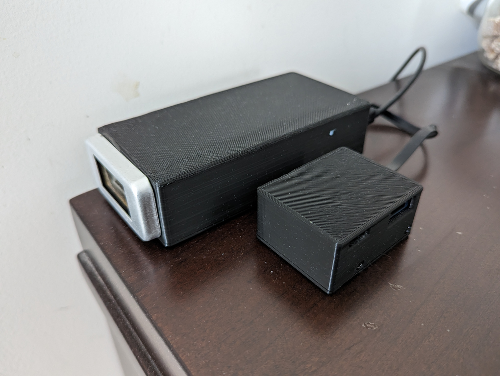
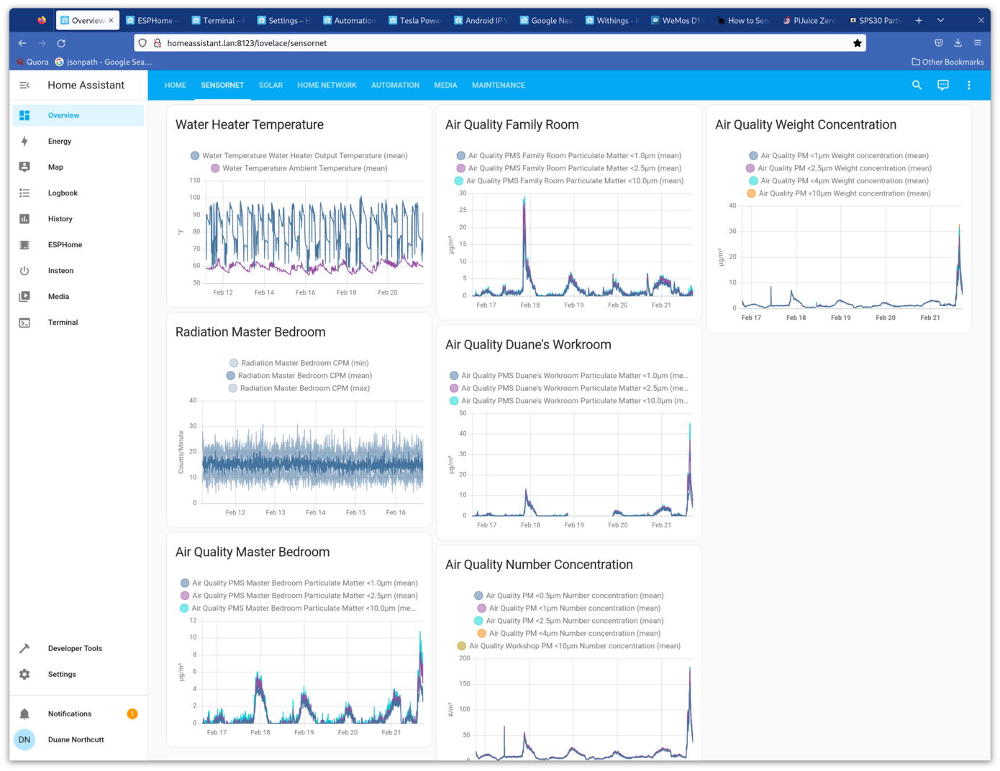
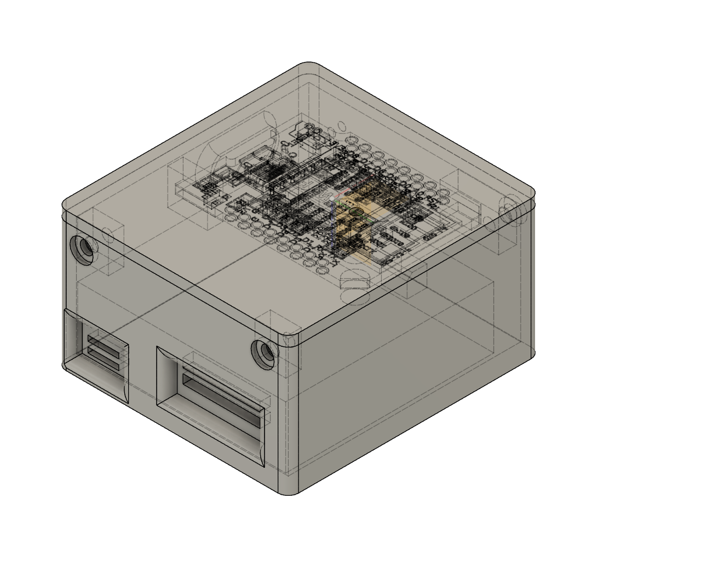
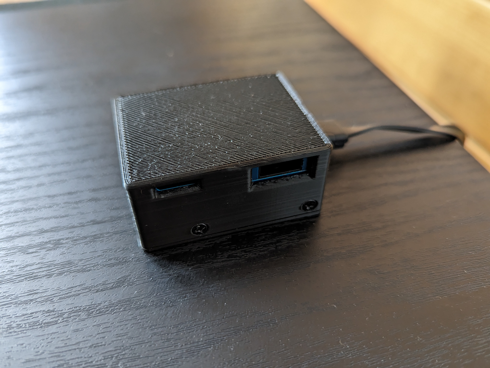
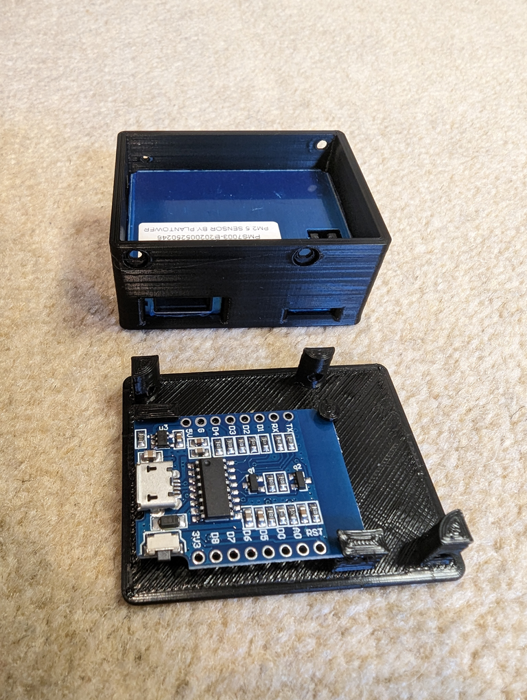
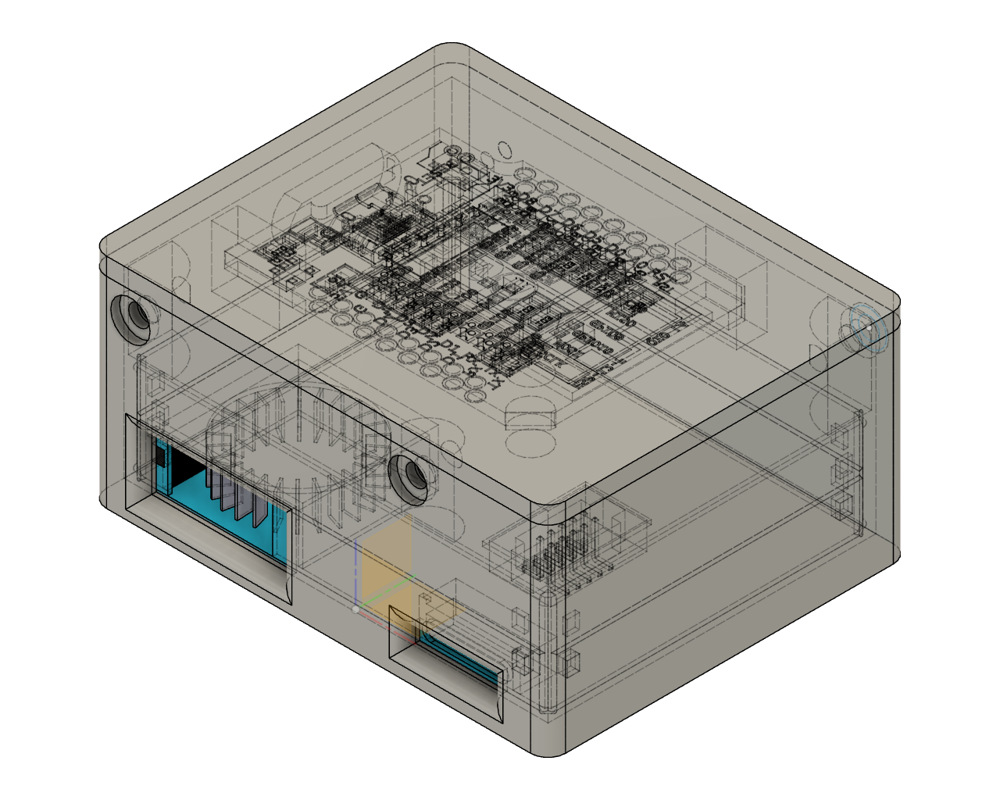
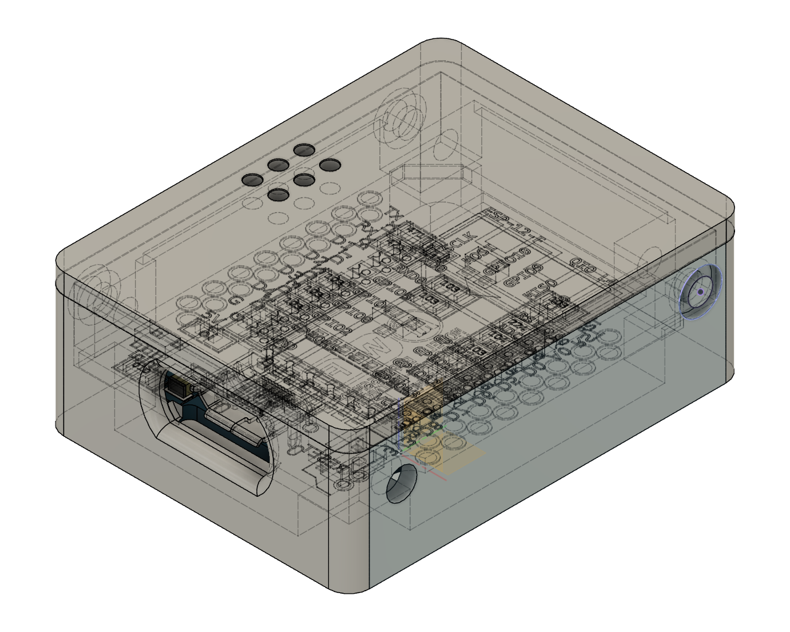

# SensorNet

Collection of ESP8266-based sensors that are managed by ESPHome which is integrated with Home Assistant.

**WIP**
Converting the HW to use ESP8266 Wemos D1 mini and integrating with Home Assistant and ESPHome. 

It turns out that ESPHome does everything I was doing with this project, but in a much better way, and it's got an active community as well, so it's better to just abandon this code and go with the new stuff for V2

TBD: add cad files and images for enclosures

TODO: refactor and put the common services in separate library projects/repos (or maybe not)

#### Example Sensors

#### Example Home Assistant Dashboard

# Software Framework

The current version of this project uses ESPHome and Home Assistant.

Related Links:
  * https://esphome.io
  * https://github.com/esphome/esphome
  * https://www.home-assistant.io

## Sensors

Notes:
  * Standardized on ESP8266 Wemos D1 Mini boards as the controllers (don't need to use ESP32s for these simple sensors).
  * Use the ESP8266 board's microUSB connector to power the entire device (and to do initial ESPHome firmware load).
  * Each device has an ESPHome (yaml) definition, which contains the information about the ESP pins used by the device.
  * Each device has a 3D (STEP/STL?) model for its enclosure.
  * RSSI is provided for each device to help ensure good connections
  - -30 dBm: amazing
    * max value, not necessary
  - -67 dBm: very good
    * min required for reliable streaming
  - -70 dBm: okay
    * min for reliable packet delivery
  - -80 dBm: not good
    * barely usable, not reliable
  - -90 dBM: unusable
    * near noise floor

Related Links:
  * https://github.com/espressif/
  * https://escapequotes.net/esp8266-wemos-d1-min-pins-and-diagram/
  * https://wiki.seeedstudio.com/Connect-Grove-to-Home-Assistant-ESPHome/

### AirQuality

Measure airborne particulate matter of different sizes.

#### Sensirion SPS30 (SPS)

*TBD*

Related Links:
  * https://cdn.sparkfun.com/assets/2/d/2/a/6/Sensirion_SPS30_Particulate_Matter_Sensor_v0.9_D1__1_.pdf
  * https://github.com/Sensirion/arduino-sps
  * https://github.com/paulvha/sps30
  * https://www.14core.com/wiring-senserion-sps30-pm-optical-sensor-with-atmega4809-avr/
  * https://tasmota.github.io/docs/SPS30/

#### Plantower PMS7003 (PMS)

*TBD*

### Radiation (Radiation)

Measure alpha, beta, gamma radiation.

*TBD*

Notes:
* ESP8266 Board
  - rx: GPIO3
  - tx: GPIO?
  - sleep: GPIO?
  - reset: GPI04

#define GK_RESET          2   // GPIO0 aka D4, active low

* GK Board
  - Settings
    * controlled by menus/LCD/buttons or IR remote control
    * saved in on-board persistent memory
  - I/O Connector
    * 1: GND (N.C.)
    * 2: GND
    * 3: UC_PWR (+5V)
    * 4: TXD
    * 5: RXD
    * 6: RST
  - Logging
    * output rate defined by "Log Period Menu" setting
    * serial port: 9600 8N1
    * example output:
      - "36,0.2052,4.79<CR>/<LF>" -- i.e, (36 CPM, 0.2052 dose, 4.79V)
  - display options
    * DogM LCD uses SPI interface
    * can use 2x8 (aot 2x16) LCD instead
  - battery power
    * Pololu 2119: LiPo boost to 5VDC
    * 9V battery: ~16hrs of use
    * ~35mA current draw steady state (~24mA w/o display)
    * runs ~22 hrs on 1200mAh LiPo
* Radiation Sensors
  - CBT11(A)
    * alpha, beta, and gamma
    * mica window
    * 'A' means thinner mica window, so more sensitive
    * starting voltage: 260-320V, operating voltage: 390V
    * 44-49 cps/uR/sec
      - 318 CPM/uSv/hr
* Annual human exposure
  - natural US: 3.10 mSv/year -- mostly inhalation of air (indoor radon accumulation)
  - artificial US: 3.14 mSv/year -- mostly medical (CT scans and nuclear medicine)
  - total: 6.24 mSv/year
  - ROW: half this amount
* mRem: milliroentgens
  - REM = 0.1 Sievert
  - 1 uSv = 0.1 mRem

Related Links:
  * https://github.com/impexeris/DiY-Arduino-Geiger-Counter-SMD/tree/master/Circuit%20Schematics
  * https://arduino-geiger-pcb.blogspot.com/
  * https://github.com/impexeris/Arduino-Geiger-PCB/wiki
  * https://sites.google.com/site/diygeigercounter/home/software-features

### WaterHeater (WaterHeater)

Measure temperature at the outlet of water heater and ambient temperature.

*TBD*

pins (starting from side with usb connector):
  1: +5V
  2: D4/GPIO2 2.2KOhm pullup
  3: GND

### Hummingbird Feeder Scale (BirdyNomNom)

Measure weight of sugar water in hummingbird feeder.

*TBD*

### Weather Sensor Platform

*TBD*

### Avue PZT Camera Platform (avue)

Monitor the internal temperature and WiFi signal strength of my Avue PZT camera controller ([AvuePZT](https://github.com/jduanen/avuePZT)).

*TBD*

## Notes

### Topics

* /sensors
    - /sensors/AirQuality/
        + /sensors/AirQuality/PMS/*WifiMAC*
            * latest version: 1.1.0
            * /sensors/AirQuality/PMS/*WifiMAC*/data
                - payload:
                    * pm1_0:d: ????
                    * pm2_5:d: ????
                    * pm10_0:d: ????
            * /sensors/AirQuality/PMS/*WifiMAC*/cmd
                - commands:
                    + *TBD*
        + /sensors/AirQuality/SPS/*WifiMAC*
            * latest version: 1.0.2
            * /sensors/AirQuality/SPS/*WifiMAC*/data
                - payload:
                    * pm1_0:.2f: ????
                    * pm2_5:.2f: ????
                    * pm4_0:.2f: ????
                    * pm10_0:.2f: ????
                    * nc0_5:.2f: ????
                    * nc1_0:.2f: ????
                    * nc2_5:.2f: ????
                    * nc4_0:.2f: ????
                    * nc10_0:.2f: ????
                    * tps:.2f: ????
            * /sensors/AirQuality/SPS/*WifiMAC*/cmd
                - commands:
                    + *TBD*
    - /sensors/birdyNomNom/*WifiMAC*
        + /sensors/birdyNomNom/*WifiMAC*/data
        + /sensors/birdyNomNom/*WifiMAC*/cmd
    - /sensors/Radiation/*WifiMAC*
        + latest version: 1.0.2
        + /sensors/Radiation/*WifiMAC*/data
            * payload:
                - CPM:d: ????
                - uSv/h:.4f: ????
                - Vcc:.2f: ????
        + /sensors/Radiation/*WifiMAC*/cmd
            * commands:
                - *TBD*
    - /sensors/WaterHeater/*WifiMAC*
        + latest version: 0.0.0
        + /sensors/WaterHeater/*WifiMAC*/data
            * payload:
                - waterDegC:3.2f: ????
                - ambientDegC:3.2f: ????
        + /sensors/WaterHeater/*WifiMAC*/cmd
            * commands:
                - *TBD*
    - /sensors/avue/*WifiMAC*
        + latest version: 1.1.0
        + /sensors/avue/*WifiMAC*/data
            * payload:
                - temp:.1f: ????
                - q:.4f: ????
                - rssi:d: ????
        + /sensors/avue/*WifiMAC*/cmd
            * commands:
                - *TBD*

### Startup Lines

* AirQuality (PMS)
    - *ISO timestamp*,/sensors/AirQuality/PMS/*WifiMAC*/cmd,Startup,ESP8266,AirQualityPMS,1.1.0,pm1_0:d,pm2_5:d,pm10_0:d,*RSSI*
* AirQuality (SPS)
    - *ISO timestamp*,/sensors/AirQuality/SPS/*WifiMAC*/cmd,Startup,ESP8266,AirQualitySPS,1.0.2,pm1_0:.2f,pm2_5:.2f,pm4_0:.2f,pm10_0:.2f,nc0_5:.2f,nc1_0:.2f,nc2_5:.2f,nc4_0:.2f,nc10_0:.2f,tps:.2f,*RSSI*
* Radiation
    - *ISO timestamp*,/sensors/Radiation/*WifiMAC*/cmd,Startup,ESP8266,Radiation,1.0.2,CPM:d,uSv/h:.4f,Vcc:.2f,*RSSI*
* WaterHeater
    - *ISO timestamp*,/sensors/WaterHeater/*WifiMAC*/cmd,Startup,ESP8266,WaterHeater,0.0.0,waterDegC:3.2f,ambientDegC:3.2f,*RSSI*
* Avue PZT Camera
    - *ISO timestamp*,/sensors/avue/*WifiMAC*/cmd,Startup,Rpi3,AvuePZT,1.1.0,temp:.1f,q:.4f,rssi:d,*RSSI*

## TODO

* write test scripts
* create schematics for all the sensors
* document code
* make callbacks work for subs in SensorNet library
* make SensorNet a proper library
  - create kewords.txt and library.properties
  - add a README.md and LICENSE
  - create tests in examples/
  - document interface
